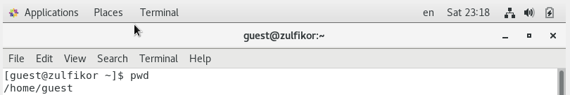
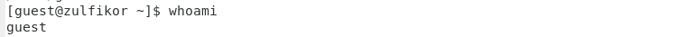
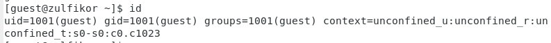
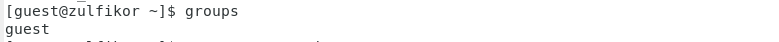
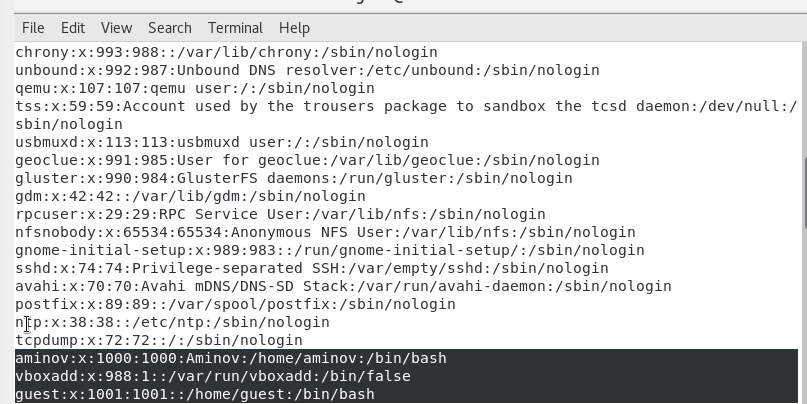
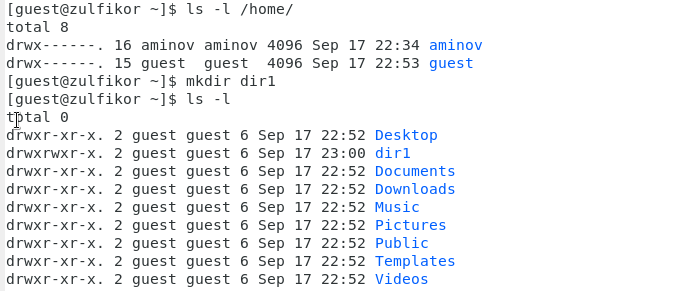
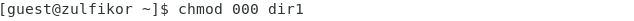
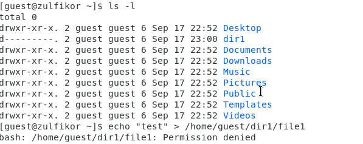
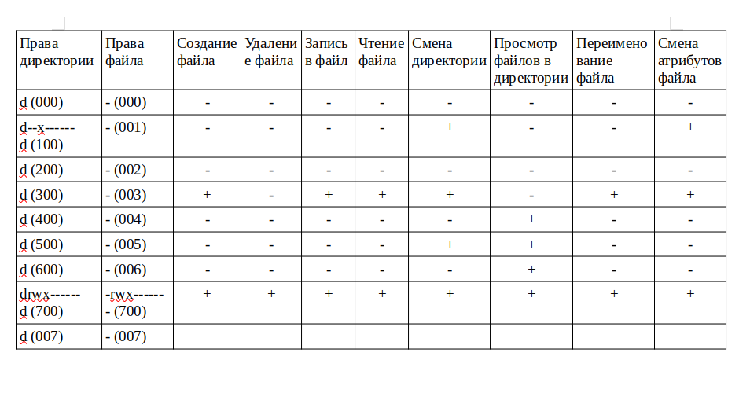

---
## Front matter
lang: ru-RU
title: Лабораторная работа №2
author: |
	 Аминов Зулфикор\inst{1}

institute: |
	\inst{1}Российский Университет Дружбы Народов

date: 16.09, 2022, Москва, Россия

## Formatting
mainfont: PT Serif
romanfont: PT Serif
sansfont: PT Sans
monofont: PT Mono
toc: false
slide_level: 2
theme: metropolis
header-includes: 
 - \metroset{progressbar=frametitle,sectionpage=progressbar,numbering=fraction}
 - '\makeatletter'
 - '\beamer@ignorenonframefalse'
 - '\makeatother'
aspectratio: 43
section-titles: true

---

# Цели и задачи работы

## Цель лабораторной работы

Получение практических навыков работы в консоли с атрибутами фай-
лов, закрепление теоретических основ дискреционного разграничения до-
ступа в современных системах с открытым кодом на базе ОС Linux.

# Задание к лабораторной работе

## Упражнение

Заполните таблицу «Установленные права и разрешённые действия»
(см. табл. 2.1), выполняя действия от имени владельца директории (фай-
лов), определив опытным путём, какие операции разрешены, а какие нет.
Если операция разрешена, занесите в таблицу знак «+», если не разре-
шена, знак «-».

# Результат работы

## Создание учетной записи пользователя

Создали учетной запись пользователя guest, установил парол и вошел в нее.

## Определили директорию, в которой мы находились, командой pwd

{ #fig:001 width=100% height=100% }

## Уточнили имя нашего пользователя

{ #fig:002 width=100% height=100% }

## Уточнили имя нашего пользователя, его группу, а также группы, куда входит пользователь, командой id

{ #fig:003 width=100% height=100% }

## Сравнили вывод id с выводом команды groups.

{ #fig:004 width=100% height=100% }

## Просмотрели файл /etc/passwd командой cat /etc/passwd

{ #fig:005 width=100% height=100% }

## Также просмотрели файл /etc/passwd командой cat /etc/passwd | grep guest

{ #fig:006 width=100% height=100% }

## Определили существующие в системе директории командой ls -l /home/

{ #fig:007 width=100% height=100% }

## Создали в домашней директории поддиректорию dir1 командой mkdir dir1

Определили командами ls -l и lsattr, права доступа и расширенные атрибуты

## Снимали с директории dir1 все атрибуты командой chmod 000 dir1

{ #fig:008 width=100% height=100% }

## Проверили правильность выполнения команды ls -l

{ #fig:009 width=100% height=100% }

## Созданые в директории dir1 файл file1 командой echo "test" > /home/guest/dir1/file1

Не удалось создать файл file1

## Заполнили таблицу

{ #fig:010 width=100% height=100% }

# Выводы по проделанной работе

## Вывод

Получили практических навыков работы в консоли с атрибутами фай-
лов, закрепление теоретических основ дискреционного разграничения до-
ступа в современных системах с открытым кодом на базе ОС Linux.

